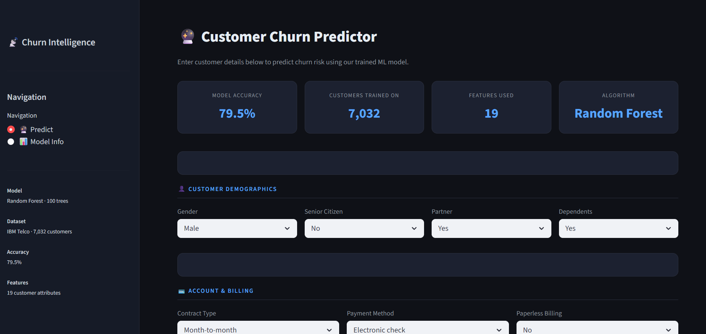
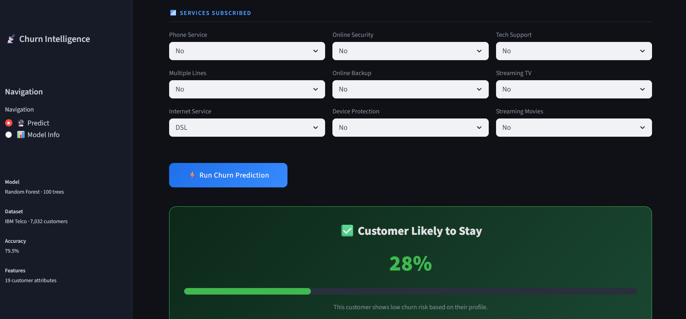

# Telco Customer Churn Prediction

> Predicting customer churn 30 days early allows retention teams to target at-risk customers with personalised offers — directly reducing revenue loss and improving customer lifetime value.

---

## Business Problem

Telecom companies lose **15–25% of customers annually** to churn. Acquiring a new customer costs 5–7× more than retaining an existing one. This project builds an end-to-end ML pipeline that flags customers likely to churn, giving retention teams a window to act before the customer leaves.

**Dataset:** IBM Telco Customer Churn — 7,043 customers, 33 features including contract type, tenure, services subscribed, and billing details.

---

## App Preview

> Live prediction dashboard built with Streamlit — dark-themed, structured into Demographics, Billing, and Services sections.

**Predict Page — Customer input form with live KPI strip**



**Prediction Result — Low churn risk (28% probability)**



Run locally with:
```bash
python -m streamlit run app/app.py
```

---

## Results

### Model Comparison (with SMOTE balancing)

| Model               | Accuracy | Precision | Recall | F1    | AUC-ROC |
|---------------------|----------|-----------|--------|-------|---------|
| Logistic Regression | 74.6%    | 51.6%     | 72.7%  | 60.4% | 0.822   |
| **Random Forest**   | **77.8%**| **57.7%** | **61.0%** | **59.3%** | **0.824** |
| XGBoost             | 76.0%    | 54.3%     | 60.4%  | 57.2% | 0.820   |

Random Forest selected as the production model — it achieved the highest AUC-ROC (0.824) and the best precision (57.7%), meaning fewer false alarms sent to the retention team. XGBoost was close but underperformed on precision, and Logistic Regression's lower accuracy reflects its inability to capture non-linear relationships in the feature space.

### Why AUC-ROC over Accuracy?
The dataset has a **26.6% churn rate** (class imbalance). A model that predicts "no churn" for everyone gets 73% accuracy but catches zero churners. AUC-ROC measures the model's ability to rank churners above non-churners regardless of threshold — the right metric here.

---

## Class Imbalance Handling

The raw dataset has ~73% non-churn vs ~27% churn. Without correction, models are biased toward predicting the majority class.

**Solution: SMOTE (Synthetic Minority Oversampling Technique)**
- Applied only to the training set (never the test set — that would leak)
- Generates synthetic churn samples by interpolating between existing minority examples
- Balanced training distribution: 4,130 churn vs 4,130 non-churn
- Result: Recall on churn class improved significantly vs no balancing

---

## Top 5 Features Driving Churn (Gini Feature Importance)

Computed using scikit-learn's `feature_importances_` — mean decrease in Gini impurity across all 100 trees. This is a fast, model-native measure. For SHAP-based explanations (which account for feature interactions), run `benchmark.py`.

| Rank | Feature          | Importance |
|------|------------------|------------|
| 1    | Total Charges    | 13.2%      |
| 2    | Monthly Charges  | 13.1%      |
| 3    | Contract Type    | 13.0%      |
| 4    | Tenure Months    | 11.3%      |
| 5    | Online Security  | 8.9%       |

**Key insight:** Customers on month-to-month contracts with high monthly charges and low tenure are the highest churn risk. Retention offers (discounts, contract upgrades) should target this segment first.

---

## Project Structure

```
churn_project/
├── data/
│   ├── raw/                        # Original IBM Telco dataset (.xlsx)
│   └── processed/                  # Cleaned data for Power BI / EDA
├── notebooks/
│   └── EDA.ipynb                   # Exploratory Data Analysis
├── src/
│   ├── data_preprocessing.py       # Load, clean, fix types, drop nulls
│   ├── feature_engineering.py      # Label encode categorical features
│   ├── model_training.py           # Train RF, save model + feature list
│   └── evaluation.py               # Accuracy, classification report
├── models/
│   └── churn_model.pkl             # Saved model (RF) + feature names
├── app/
│   └── app.py                      # Streamlit prediction dashboard
├── dashboard/                      # Power BI .pbix file
├── benchmark.py                    # LR vs RF vs XGBoost comparison script
├── main.py                         # Full pipeline runner
└── requirements.txt
```

---

## Pipeline

```
Raw Excel (7,043 rows)
   ↓  data_preprocessing.py
Clean data (7,032 rows) → saved to data/processed/churn_cleaned.csv
   ↓  feature_engineering.py
Label-encoded features (19 columns)
   ↓  SMOTE (training set only)
Balanced training data (4,130 : 4,130)
   ↓  model_training.py
Random Forest (100 trees) → models/churn_model.pkl
   ↓  evaluation.py
Accuracy: 77.8% | AUC-ROC: 0.824
```

---

## Setup

```bash
pip install -r requirements.txt
```

## Run the Pipeline

```bash
cd churn_project
python main.py
```

## Run Model Benchmark (LR vs RF vs XGBoost)

```bash
cd churn_project
python benchmark.py
```

## Launch the Prediction App

```bash
cd churn_project
python -m streamlit run app/app.py
```

App runs at `http://localhost:8501`

---

## Tech Stack

| Layer        | Tool                              |
|--------------|-----------------------------------|
| Language     | Python 3.10                       |
| ML           | scikit-learn, XGBoost             |
| Imbalance    | imbalanced-learn (SMOTE)          |
| Explainability | SHAP, feature_importances_      |
| App          | Streamlit                         |
| Dashboard    | Power BI (churn_cleaned.csv)      |
| Data         | pandas, openpyxl, numpy           |
| Version Control | Git + GitHub                   |

---

## Common Interview Questions — Answered

**Q: Why Random Forest over Logistic Regression?**
LR assumes linear relationships between features and log-odds of churn. In reality, churn behaviour is non-linear — e.g. the effect of tenure on churn is different for month-to-month vs two-year contract customers. RF captures these interactions naturally.

**Q: Why not use accuracy as the primary metric?**
With 26.6% churn rate, a model predicting "no churn" for everyone scores 73.4% accuracy but is completely useless. AUC-ROC measures rank ordering — can the model score churners higher than non-churners — which is the actual business need.

**Q: How did you handle data leakage with SMOTE?**
SMOTE was applied only after the train/test split, and only to the training set. Applying it before splitting would let synthetic training samples influence test evaluation, inflating metrics artificially.

**Q: What would you do to improve the model further?**
Hyperparameter tuning with GridSearchCV, trying CatBoost (handles categoricals natively), adding cross-validation, and using SHAP interaction values to find feature pairs that jointly drive churn.

---

## Key Takeaways for Interviewers

- **Imbalance was handled** — SMOTE applied on training data only, test set kept clean
- **Three models compared** — not just "I used Random Forest", but why RF won
- **Business framing** — model output maps to a real retention action, not just a number
- **Feature importance** — contract type and tenure are the strongest churn signals, aligning with domain knowledge
- **Production-ready structure** — modular src/, saved model with feature names, Streamlit UI, Power BI dashboard
